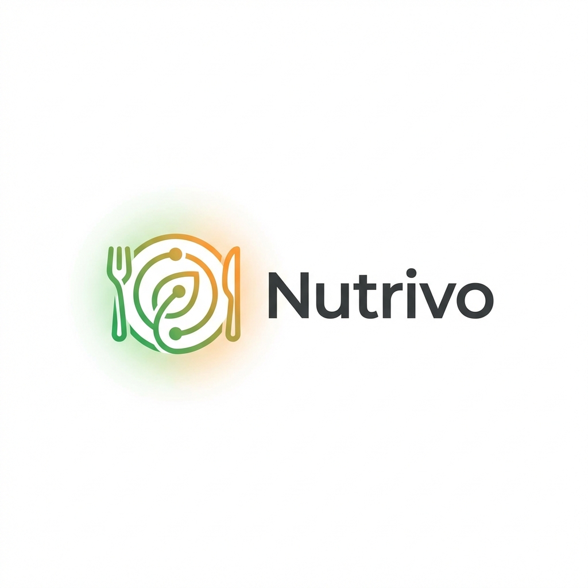

# Nutrivo (AI-Powered Meal Planner)

Nutrivo is a FastAPI + Streamlit app that turns natural-language meal planning requests into a multi-day plan with recipes, nutrition summaries, and optional AI reranking.
It combines deterministic parsing/scoring with optional LLM enhancements for ambiguous requests and tie-breaking.

## Demo / Screenshots
Live app: https://nutrivo-s873.onrender.com/



## Features
- Natural-language meal planning via `POST /api/generate-meal-plan`.
- Rules-first parser with optional LLM enhancement for ambiguous queries.
- Recipe aggregation from local JSON (`data/mock_recipes.json`) and TheMealDB.
- Deterministic scoring with diversity and macro-balance penalties.
- Optional LLM reranking of top-K candidates with short selection reasons.
- Optional USDA nutrition enrichment and cached lookups.
- Streamlit UI for interactive demos and raw JSON inspection.
- Rate limiting + request logging middleware in the API.

## How It Works
1. User submits a natural-language query (UI or API).
2. Parser extracts duration, diets, exclusions, calories, and preferences.
3. Conflict resolver enforces constraints (e.g., max 7 days, incompatible diets).
4. Recipe sources fetch and filter candidates (local + TheMealDB) with caching.
5. Deterministic scoring ranks candidates with diversity + macro balance penalties.
6. Optional LLM reranker selects among top-K candidates (per-meal or batch).
7. Planner assembles the plan and returns a summary (avg prep time, etc.).

## Tech Stack
- FastAPI + Uvicorn (API)
- Streamlit (UI)
- Pydantic (models/validation)
- OpenAI API (optional LLM enhancement + rerank)
- Requests (TheMealDB + USDA)
- Pytest (tests)

## Local Setup

### Prerequisites
- Python 3.9+
- pip

### Install
```bash
python -m venv .venv
source .venv/bin/activate
pip install -r requirements.txt
```

### Environment Variables
Copy `.env.example` and fill in only what you need:
```bash
cp .env.example .env
```
Used by the codebase:
- `OPENAI_API_KEY` (optional) for LLM query enhancement + reranking.
  - Used in `app/services/ai_service.py` and `app/services/reranker_service.py`.
- `USDA_API_KEY` (optional) for nutrition enrichment + cached lookups.
  - Used in `app/services/usda_service.py` and `app/services/sources/local.py`/`mealdb.py`.
- `API_URL` (optional) overrides the backend URL in the Streamlit UI.
  - Used in `app/frontend.py`.
- `API_DOCS_URL` (optional) overrides the FastAPI docs link in the UI.
  - Used in `app/frontend.py`.

LLM reranker settings live in `config/llm_config.json` (not environment variables):
- `rerank_enabled`, `rerank_top_k`, `rerank_mode` (`per_meal`, `per_day`, `per_plan`), `rerank_cache_ttl_seconds`.

### Run (API + UI)
```bash
python run.py
```
- API: `http://127.0.0.1:8000`
- API docs: `http://127.0.0.1:8000/docs`
- UI: `http://127.0.0.1:8501`

### Run (API only)
```bash
uvicorn app.main:app --reload --port 8000
```

### Run (UI only)
```bash
streamlit run app/frontend.py --server.port 8501
```

## Testing
```bash
pytest
```

## Deployment Notes
- Docker image uses `start.sh` to launch both API (8000) and Streamlit (8501).
- Render deployment is defined in `render.yaml` and expects a Docker build.
- `start.sh` respects `PORT` for the UI and binds both services to `0.0.0.0`.

## Tradeoffs & Limitations
- **LLM usage is optional but adds overhead:** When enabled, query enhancement and reranking increase latency and token cost. If the model returns invalid JSON, the system falls back to deterministic picks.
- **Recipe metadata is incomplete:** TheMealDB has limited diet tags, so diet/exclusion filtering is heuristic and can miss edge cases.
- **Nutrition can be approximate:** If USDA lookups fail, macro estimates are heuristic and may be imprecise.
- **Planning is local, not global:** Scoring is done per-meal slot (greedy). This can miss plan-level optima (macro balance/diversity across all days).
- **LLM only sees top‑K candidates:** Reranking is limited to the shortlisted recipes, so a better option outside top‑K may be missed.
- **Retrieval is bounded:** Local recipes are finite and TheMealDB is sampled, which caps diversity.
- **Caches are ephemeral:** In-memory caches reset on restart and are not shared across processes.
- **Cost is a placeholder:** `estimated_cost` is static today.
- **Hard caps exist:** Requests over 7 days are rejected by `app/services/conflict_resolver.py`.
- **Limited evaluation:** Beyond unit tests, there’s no automated plan-quality evaluation harness.

## Future Improvements (Prioritized)
1. **Plan-level optimization (replace greedy selection):** use a constraint solver (e.g., OR-Tools CP-SAT) to enforce macro balance, diversity, and prep-time budgets across the full plan.
2. **Persistent caching + shared rate limits:** add Redis for MealDB/USDA lookups and reranker results, with cache stampede protection and distributed rate limiting.
3. **Evaluation harness + regression suite:** build a labeled query set and metrics (diet compliance, macro deviation, diversity score) to compare deterministic scoring vs. LLM rerank.
4. **Richer sources + normalized metadata:** add more recipe providers and map ingredients → diet taxonomy to improve compliance and reduce heuristic filtering.
5. **Nutrition accuracy upgrades:** improve ingredient parsing (quantities/units) and enrich macros with higher-quality food data sources.
6. **Personalization & memory:** store user profiles (user_id), preferences, and feedback to adapt plans over time.
7. **Budget + cost estimation:** integrate price data to generate per-plan cost estimates and enforce budget constraints.
